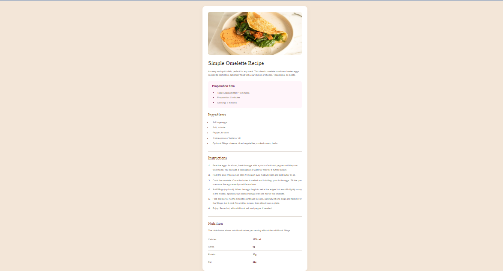

# Frontend Mentor - Recipe page solution

This is a solution to the [Recipe page challenge on Frontend Mentor](https://www.frontendmentor.io/challenges/recipe-page-KiTsR8QQKm). Frontend Mentor challenges help you improve your coding skills by building realistic projects. 

## Table of contents

- [Overview](#overview)
  - [The challenge](#the-challenge)
  - [Screenshot](#screenshot)
  - [Links](#links)
- [My process](#my-process)
  - [Built with](#built-with)
  - [What I learned](#what-i-learned)
  - [Continued development](#continued-development)
  - [Useful resources](#useful-resources)
- [Author](#author)

## Overview

### The challenge

Your challenge is to build out this recipe page and get it looking as close to the design as possible.

### Screenshot



### Links

- Solution URL: [solution URL](https://oms-create-oms-recipe-page.vercel.app/)
- Live Site URL: [live site URL](https://github.com/OMS-Create/oms-recipe-page)

## My process

### Built with

- Semantic HTML5 markup
- CSS custom properties (variables)
- CSS Grid
- Mobile-first workflow
- Vanilla CSS

### What I learned

During this project, I reinforced my knowledge of setting up root variables for consistent color theming across the document. I also learned how to specifically target and style list bullets and numbers using the `::marker` pseudo-element, which keeps the HTML semantic and clean without needing extra span tags.

```css
/* Styling the list markers to match the design */
.ingredients ul li::marker {
  color: var(--brown-800);
}

.instructions ol li::marker {
  color: var(--brown-800);
  font-weight: 700;
}
```

I also effectively used CSS Grid on the body element to perfectly center the main card component on the page:

```css
body {
  display: grid;
  place-items: center;
  min-height: 100vh;
}
```

### Continued development

In future projects, I want to continue refining my use of semantic HTML structure and CSS variables. I also plan to keep practicing responsive design patterns, ensuring seamless transitions from mobile to desktop layouts using clean media queries.

### Useful resources

- [MDN Web Docs: ::marker](https://developer.mozilla.org/en-US/docs/Web/CSS/::marker) - This was essential for understanding how to properly color and style the unordered and ordered list markers.
- [CSS-Tricks: A Complete Guide to Grid](https://css-tricks.com/snippets/css/complete-guide-grid/) - A fantastic reference for easily centering items using grid.

## Author

- Developer - Olamiji Michael
- Frontend Mentor - [@OMichaels](https://www.frontendmentor.io/profile/OMichaels)
